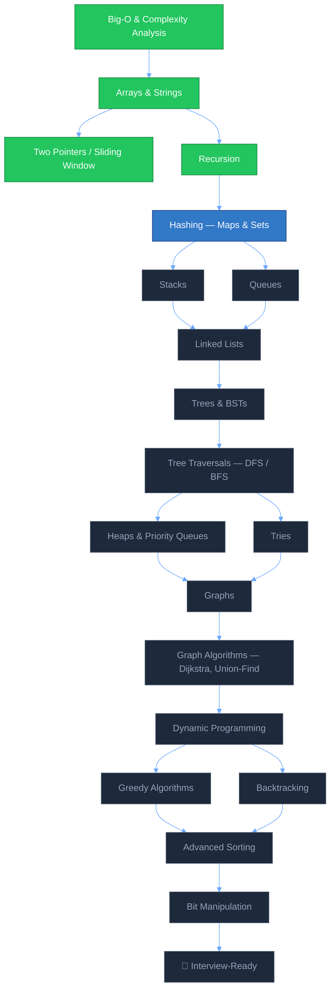

<div style="font-family: 'Edu VIC WA NT Hand', 'Segoe Print', cursive; color: #e2e8f0; line-height: 1.7; background: #0b1220; padding: 24px; border-radius: 18px;">
<div align="center">


<br/>

<a href="#roadmap">
  
</a>

<br/><br/>


</div>

<br/>

## Why This Repository Exists

Every developer today has AI finishing their sentences — autocomplete writes the loop, a model drafts the query, a copilot ships the feature. That's genuinely useful. Right up until someone asks _why_ this runs in `O(n log n)` instead of `O(n²)`, and the honest answer can't just be "the AI wrote it that way."

I don't want that to be my answer.

I'm a full-stack developer, and I already think in TypeScript — so instead of learning DSA in a vacuum, I'm rebuilding it in the language I ship products with. Every structure here is typed, tested, and understood _before_ it gets checked off. No copy-pasted solutions, no shortcuts, no outsourcing the reasoning.

> **This repo is the receipt.** Not a claim that I know DSA — a running, dated, public log of me actually learning it.

<br/>

<div align="center">

### 🧭 &nbsp; [Roadmap](#roadmap) &nbsp;·&nbsp; [Progress](#progress-dashboard) &nbsp;·&nbsp; [Structure](#repository-structure) &nbsp;·&nbsp; [Stack](#tech-stack) &nbsp;·&nbsp; [Run Locally](#run-locally) &nbsp;·&nbsp; [Connect](#connect)

</div>

<br/>

## Roadmap

The full path, mapped as a dependency graph rather than a flat list — because that's how these concepts actually build on each other.



<details>
<summary><b>🌸 Foundations</b> — click to expand</summary>
<br/>

- [x] Big-O Notation & Complexity Analysis
- [x] Arrays & Strings
- [x] Two Pointers / Sliding Window
- [x] Recursion Basics
- [ ] Hashing (Maps & Sets)
- [ ] Stacks
- [ ] Queues

</details>

<details>
<summary><b>🌸 Core Structures</b> — click to expand</summary>
<br/>

- [ ] Linked Lists (Singly / Doubly)
- [ ] Trees (Binary, BST)
- [ ] Tree Traversals (DFS / BFS)
- [ ] Heaps & Priority Queues
- [ ] Tries

</details>

<details>
<summary><b>🌸 Advanced</b> — click to expand</summary>
<br/>

- [ ] Graphs (Adjacency List / Matrix)
- [ ] Graph Algorithms (BFS, DFS, Dijkstra, Union-Find)
- [ ] Dynamic Programming (1D & 2D)
- [ ] Greedy Algorithms
- [ ] Backtracking
- [ ] Advanced Sorting (Merge, Quick, Heap Sort)
- [ ] Bit Manipulation

</details>

<details>
<summary><b>🌸 Applied Practice</b> — click to expand</summary>
<br/>

- [ ] Weekly LeetCode / NeetCode Problem Sets
- [ ] Pattern Notes (one markdown breakdown per topic)
- [ ] Mock Interview Write-ups

</details>

<br/>

## Progress Dashboard

<div align="center">

| Track            | Progress                                                  |     Status     |
| :--------------- | :-------------------------------------------------------- | :------------: |
| Foundations      |  |  ✅ Complete   |
| Hashing          |   | 🟡 In Progress |
| Core Structures  |    |   ⚪ Queued    |
| Advanced         |    |   ⚪ Queued    |
| Applied Practice |    |   ⚪ Queued    |

</div>

<sub>Bars update as topics close out — this table is the single source of truth for where I actually am, not where I'd like to be.</sub>

<br/>

## Repository Structure

```text
dsa-in-typescript/
├── src/
│   ├── Arrays/
│   │   ├── BuySellStock.ts
│   │   ├── ConMostWater.ts
│   │   ├── firstAndLastPosition.ts
│   │   ├── IsPalindrome.ts
│   │   ├── MaxGap.ts
│   │   ├── Pow.ts
│   │   ├── ProductOfArrayExceptItseff.ts
│   │   └── TwoPoninter.txt
│   │
│   ├── Pointers/
│   │   ├── AggresiveCows.ts
│   │   ├── BinarySearch.ts
│   │   ├── BookAllocation.ts
│   │   ├── GoodPractices.ts
│   │   ├── Introduction.ts
│   │   ├── MinInRotatedSortedArr.ts
│   │   ├── Notes.txt
│   │   ├── PeakElementWithoutMountainArray.ts
│   │   ├── PeakIndexInMountainArray.ts
│   │   ├── RotatedSortedArray.ts
│   │   ├── SingleElementInSortedArray.ts
│   │   └── WallPainting.ts
│   │
│   ├── Recursion/
│   │   └── Intro.ts
│   │
│   ├── Sorting/
│   │   ├── BubbleSort.ts
│   │   ├── InsertionSort.ts
│   │   ├── SelectionSort.ts
│   │   └── Problems/
│   │       └── Pb1.ts
│   │
│   ├── Strings/
│   │   ├── intro.ts
│   │   └── problems/
│   │       ├── docs.txt
│   │       ├── Freq&Permutation.ts
│   │       ├── isPalindrome.ts
│   │       ├── removeOcc.ts
│   │       ├── ReverseString.ts
│   │       ├── ReverseWords.ts
│   │       └── StringCompression.ts
│   │
│   └── utilities/
│
├── advanced-concepts/
│   ├── LinkedList/
│   ├── StackQueue/
│   ├── Trees/
│   ├── Graphs/
│   ├── Heaps/
│   ├── DynamicProgramming/
│   ├── Greedy/
│   ├── Backtracking/
│   └── BitManipulation/
│
├── hero-banner.svg
├── index.html
├── package.json
├── package-lock.json
├── tsconfig.json
├── test.ts
├── test.js
├── commit.sh
├── .gitignore
├── keybindings.json
├── README.md
└── node_modules/
```

This project is currently organized by topic and is steadily expanding into advanced problem-solving areas like linked lists, trees, graphs, heaps, stacks, queues, and dynamic programming.

<br/>

## Tech Stack

<div align="center">


</div>
 
<div align="center">
<sub>Every structure implemented from scratch with full type coverage — no <code>any</code>, no shortcuts.</sub>
</div>

<br/>

## Run Locally

```bash
git clone https://github.com/armanihsan-dev/DSA_TypeScript.git
cd DSA_TypeScript
npm install


```

<br/>

## Connect

<div align="center">

<a href="https://www.linkedin.com/in/arman-khan-5a790430a"></a>
<a href="pro.armanihsan.com"></a>
<a href="mailto:armanihsan224@gmail.com"></a>

<i>"In the age of AI, being a real engineer means still knowing why the code works."</i>

<br/>

</div>
</div>
